# Specification

`gate` is a local-development HTTPS reverse proxy and port registry, shipped as a
single Go binary. It maps local domains to local dev servers, keeps domain and
port reservations stable across projects, and can expose selected local routes
to other devices for testing.

> [!NOTE]
> `gate` is not a production proxy. It is designed for developer machines, local
> services, and temporary test exposure.

---

## 1. Product Boundary

### Goals

| Goal | What gate provides |
| --- | --- |
| Local HTTPS by domain | `https://app.localhost` or a custom local domain routes to a local upstream such as `127.0.0.1:4310`. |
| Stable port assignment | A machine-wide registry reserves ports so projects do not hard-code or guess ports. |
| Project-local config | `gate.toml` is the shareable source of truth for a repository's local routes. |
| Global reservations | A developer can reserve a named domain and port without a project file. |
| Daemon hot reload | A resident proxy can receive new routes without restarting. |
| Script/agent compatibility | Commands keep stdout data separate from stderr diagnostics; JSON output is stable and parseable. |
| Temporary external test access | LAN, Cloudflared, and Tailscale providers can expose selected local services. |

### Non-goals

| Non-goal | Reason |
| --- | --- |
| Production traffic | gate terminates local dev traffic and assumes a developer-controlled machine. |
| Hosted environments | gate is not a server deployment platform. |
| Owning dev server processes | gate can run a child command with `PORT` injected, but it does not manage arbitrary service lifecycles as a process supervisor. |
| Replacing DNS infrastructure | gate only handles local `.localhost`, local hosts-file reflection, and provider-specific exposure workflows. |
| Default public exposure | Any route reachable outside loopback must be explicitly exposed. |

---

## 2. System Overview

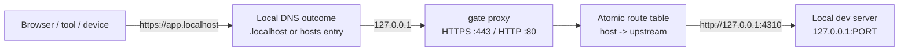

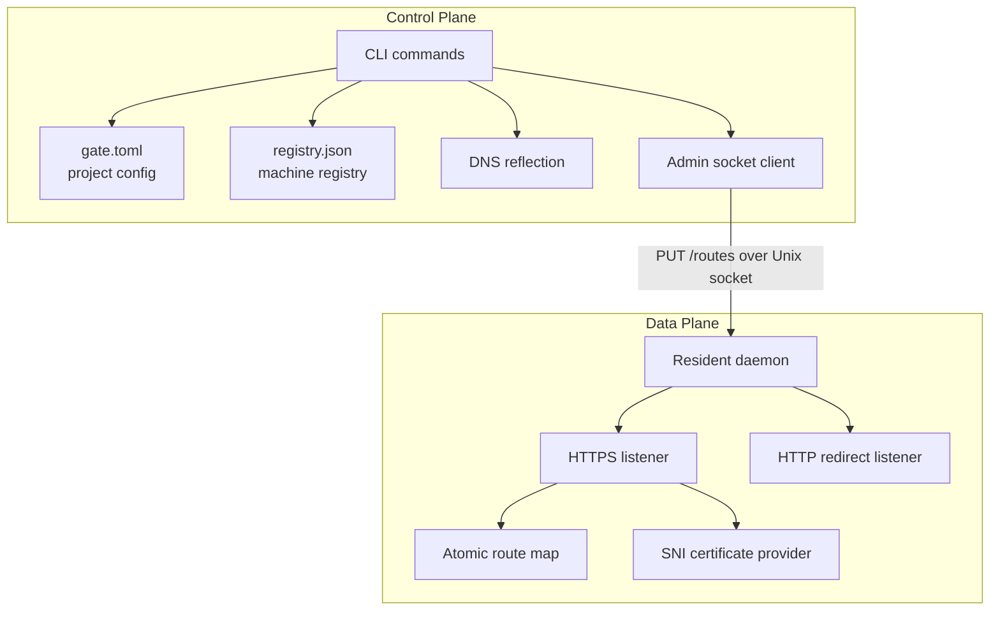

The CLI computes desired state from project config and the registry. Daemons are
scoped: project daemons serve one project, and the global daemon serves global
reservations. If the relevant daemon is running, the CLI pushes that
scope's active route table through its admin socket. If the daemon is not
running, route reservations still persist and can be loaded later.

---

## 3. Core Concepts

### Project

A project is a repository with a `gate.toml` file. `gate` discovers the file by
walking upward from the current directory until it finds `gate.toml`, a `.git`
root, the user's home directory, or the filesystem root.

```toml
[project]
name = "myapp"

[services.web]
domain = "app.localhost"

[services.api]
domain = "api.localhost"
port = 3001
```

### Service

A service maps one domain to one upstream port. If a service does not specify a
port, gate allocates one from the default pool and stores the reservation.

### Reservation

A reservation is the persisted binding of `project/service -> domain -> port`.
It survives dev server restarts.

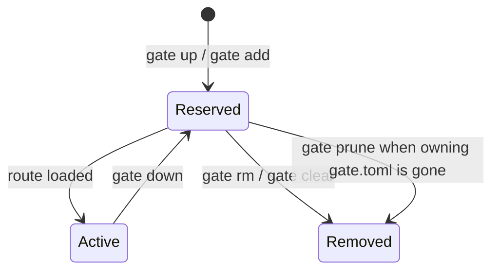

### Active Route

An active route is a reservation currently loaded into the proxy. The `Active`
flag controls whether it is included in the daemon route table. `gate down`
deactivates scoped routes but preserves reservations.

### Liveness

Liveness is not persisted. gate checks whether a dev server is listening by
dialing the reserved upstream. A reserved service can be `down` when no process
is listening.

---

## 4. Project Configuration

`gate.toml` is intentionally small. The common case is a project name plus one
or more service domains. Environment-backed values are available for projects
that need per-developer domains or ports, but they are not required for ordinary
local routing.

### Project Fields

| Field | Type | Default | Meaning |
| --- | --- | --- | --- |
| `name` | string | required | Stable project key used in registry ownership such as `myapp/web`. |
| `env_files` | string array | empty | Dotenv files used only for environment interpolation in service fields. |

`env_files` entries are resolved relative to `gate.toml`. Missing files are
ignored. Process environment values win over dotenv values, and earlier dotenv
files win over later ones.

### Service Fields

| Field | Type | Default | Meaning |
| --- | --- | --- | --- |
| `domain` | string | required | Hostname gate routes. Canonicalized as lowercase without trailing dot. |
| `port` | integer or env string | auto-allocate | Local upstream port. `0` or omitted means allocate from the default pool. |
| `tls` | `internal` or `acme` | `internal` | Certificate provider for the domain. |
| `acme_dns` | string | required for `acme` | DNS-01 provider key. |

`domain` and `port` can include environment references through `${NAME}` or
`${NAME:-fallback}`. `${NAME}` is required and fails if unset. `${NAME:-fallback}`
uses the fallback when the variable is unset or empty.

```toml
[project]
name = "myapp"
env_files = [".env.local", ".env"]

[services.web]
domain = "${WEB_DOMAIN:-app.localhost}"
port = "${WEB_PORT:-3000}"
```

---

## 5. Storage Layout

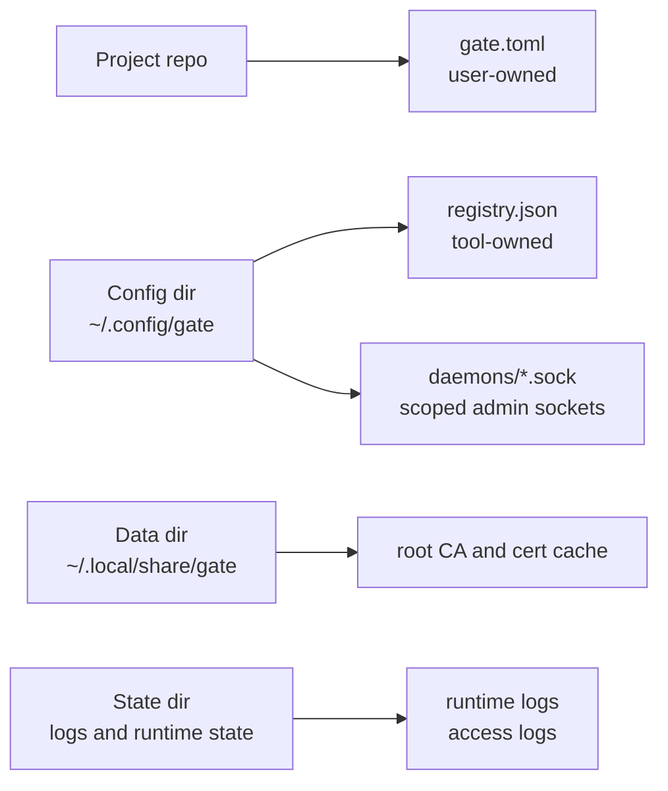

| Data | Owner | Format | Notes |
| --- | --- | --- | --- |
| `gate.toml` | user and CLI | TOML | Shareable project config. Edited surgically so comments and surrounding formatting survive. |
| `registry.json` | gate only | JSON | Machine-wide reservations. Uses schema versioning, advisory file locking, and atomic write by temp file + rename. |
| Admin sockets | daemon | Unix sockets | CLI talks to scoped daemons over a local HTTP API. |
| CA material | gate | PEM files | Root key is private local state and must not be copied. Export only the root certificate. |
| Logs | gate / OS service manager | text or JSONL | Runtime and access logs are separate from command data output. |

Registry schema:

```json
{
  "version": 1,
  "services": {
    "myapp/web": {
      "project": "myapp",
      "service": "web",
      "domain": "app.localhost",
      "port": 4310,
      "tls": "internal",
      "dns": "localhost",
      "active": true,
      "config_path": "/repo/gate.toml"
    },
    "/web": {
      "service": "web",
      "domain": "web.localhost",
      "port": 4301,
      "tls": "internal",
      "standalone": true,
      "active": true
    }
  }
}
```

---

## 6. Port Management

The default allocation pool is owned by `internal/port`. When a service omits
`port`, gate chooses an available port that is not already reserved and is not
currently bound by the OS.

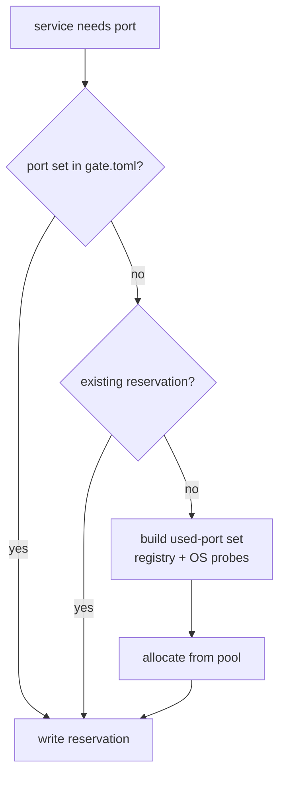

Rules:

- Domains are globally unique on the machine.
- Reserved ports are globally unique on the machine when non-zero.
- Existing reservations keep their ports unless config changes.
- Fixed ports from `gate.toml` win over automatic allocation.
- Port reservation is best-effort; the OS can still let another process bind a
  reserved port while the dev server is down.

---

## 7. DNS Modes

| Mode | When used | Permission | Behavior |
| --- | --- | --- | --- |
| `localhost` | Domains ending in `.localhost` | none | No file changes. Modern resolvers map `.localhost` to loopback. |
| `hosts` | Custom local domains | sudo may be required | gate writes only its managed block in `/etc/hosts`. |

Mode is selected from the domain or forced with `--dns localhost|hosts`.

```text
# gate managed block
127.0.0.1  app.example.test
127.0.0.1  api.example.test
```

Hosts-file editing is guarded by ownership and symlink checks. Permission
failures return exit code `3`.

---

## 8. TLS

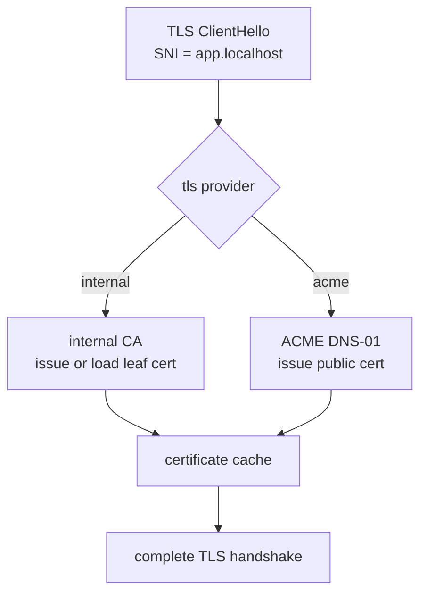

### Internal CA

The default provider creates a local root CA and issues leaf certificates for
local domains. Run `gate trust` once to install the root certificate into OS and
browser trust stores. Run `gate untrust` to remove that root certificate from
local trust stores without deleting local gate data.

For another device, export the root certificate:

```bash
gate ca export --out gate-root.crt
```

Never copy or share the root private key.

### ACME

The `acme` provider is for domains the developer actually controls. It uses
DNS-01 so local inbound ports are not required. `acme_dns` identifies the DNS
provider integration.

```toml
[services.api]
domain = "api.dev.example.com"
tls = "acme"
acme_dns = "cloudflare"
```

---

## 9. Proxy Behavior

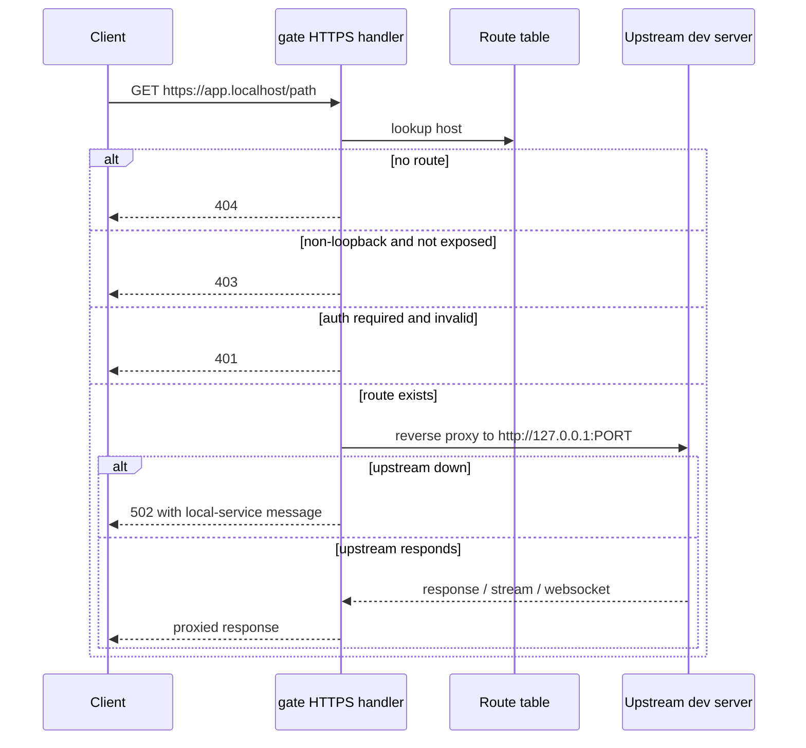

Implementation notes:

- Route lookup is by canonical host, excluding any request port.
- Route table reload uses `atomic.Pointer`; new requests see the new table,
  in-flight requests keep their current route.
- HTTP requests on the plaintext listener redirect to HTTPS.
- The reverse proxy preserves streaming behavior with immediate flushing.
- WebSocket, SSE, HMR, and HTTP/2 are treated as ordinary reverse-proxy traffic.
- Non-loopback clients are blocked unless the route has been explicitly exposed.
- Optional per-route basic auth is enforced before proxying.

---

## 10. Daemon and Admin Socket

Each daemon owns one pair of front proxy listeners. The CLI controls each daemon
over a scoped Unix-domain socket.

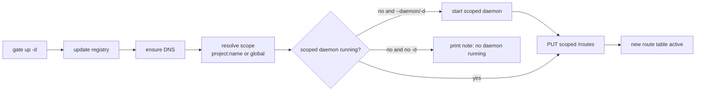

Admin API:

| Method | Path | Purpose |
| --- | --- | --- |
| `GET` | `/status` | Return daemon PID, route count, uptime, and listen addresses. |
| `PUT` | `/routes` | Replace the active route table. |
| `POST` | `/reload` | Reserved reload endpoint; currently reports reload success. |

Only one daemon can own a given HTTPS/HTTP listen address pair. Different
project daemons can run at the same time when their listen addresses do not
conflict. `gate up -d` checks only the current project daemon; a different
daemon conflicts only when the new process cannot bind the requested address.

---

## 11. Command Surface

| Command | Purpose | Data mode |
| --- | --- | --- |
| `gate init [-y] [--name name] [--force]` | Scaffold a starter `gate.toml`. | text / json |
| `gate up [-g\|--global] [-p name\|--project name] [-d\|--daemon] [--dns localhost\|hosts] [--https-addr addr] [--http-addr addr]` | Reserve current-project ports or activate existing scoped reservations, reflect DNS, reload routes, optionally start daemon. | text / json |
| `gate down [-g\|--global] [-p name\|--project name]` | Deactivate scoped routes and preserve reservations. | text / json |
| `gate ls [-g\|--global] [-p name\|--project name] [-a\|--all] [--status live\|down]` | List scoped reservations and liveness. | text / json |
| `gate port [-g\|--global] [-p name\|--project name] [-a\|--all] [service]` | Print one scoped port or list reserved ports. | text / json |
| `gate add [-g\|--global] [-p name\|--project name] <service> <domain> <port>` | Add a scoped service/name reservation. | text / json |
| `gate rm [-g\|--global] [-p name\|--project name] <service>` | Remove one scoped service/name reservation. | text / json |
| `gate clear [-g\|--global] [-p name\|--project name] [-y\|--yes]` | Remove all reservations in one scope. | text / json |
| `gate prune` | Remove reservations whose owning config no longer exists. | text / json |
| `gate run [-g\|--global] [-p name\|--project name] <service> -- <cmd>` | Run a child command with `PORT` injected from a scoped reservation. | child stdio |
| `gate daemon start [-g\|--global] [-p name\|--project name] [--https-addr addr] [--http-addr addr]` | Start the scoped resident proxy. | text |
| `gate daemon stop [-g\|--global] [-p name\|--project name] [-a\|--all]` | Stop scoped daemon(s). | text |
| `gate daemon restart [-g\|--global] [-p name\|--project name] [--https-addr addr] [--http-addr addr]` | Restart one scoped daemon. | text |
| `gate daemon logs [-g\|--global] [-p name\|--project name] [-a\|--all]` | Print scoped daemon logs. | text |
| `gate daemon status [-g\|--global] [-p name\|--project name] [-a\|--all]` | Print scoped daemon status. | text / json |
| `gate doctor [--fix] [--json]` | Check and repair local gate-owned state. | text / json |
| `gate trust` | Install the local root CA into trust stores. | text |
| `gate untrust` | Remove the local root CA from trust stores. | text |
| `gate uninstall [-y\|--yes] [--keep-trust] [--keep-brew]` | Remove gate state, binaries, and Homebrew package when applicable. | text |
| `gate ca export [--out path]` | Export the local root certificate. | text |
| `gate expose [-g\|--global] [-p name\|--project name] <service> --via <provider> [--auth user:pass]` | Expose a scoped service/name through a provider. | text / json |
| `gate completion bash\|zsh\|fish` | Print shell completion. | script |
| `gate upgrade [-y\|--yes]` | Upgrade to the latest release. | text |
| `gate skill path\|print` | Locate or print the bundled agent skill. | text |

Scope flags are mutually exclusive. Without a scope flag, registry commands use
the current project when a `gate.toml` is discoverable; otherwise they use the
global scope. `gate rm <service>` edits the current project's `gate.toml` when
the default current-project scope is selected. `gate clear` removes registry,
route, and DNS state only; it does not edit project config files.

### Shell Completion

`gate completion bash|zsh|fish` prints shell completion scripts. Completion is
read-only: it may read the registry, current project config, and known project
config paths, but it must not start daemons, modify DNS, trust certificates, or
write files. Missing or invalid local state yields no candidates rather than
shell-visible errors. Candidates are stable-sorted.

Completion mirrors the command surface:

- root commands come from public command specs; hidden/internal commands are not
  advertised
- `daemon` completes `start`, `stop`, `restart`, `status`, and `logs`
- `ca` completes `export`; `skill` completes `path` and `print`
- `completion` completes `bash`, `zsh`, and `fish`
- `--<tab>` completes long flags for the current command/subcommand; `-<tab>`
  completes short flags; `-h|--help` are common help candidates

Dynamic candidates:

- `--project` completes project names from the local registry
- scoped service/name positionals complete current-project services by default
  inside a project, global reservation names outside a project, global names
  with `-g|--global`, and known services for a named project with
  `-p|--project`
- named-project service completion includes registry services and services from
  a known local `gate.toml` config path

Static flag-value candidates:

- `ls --status`: `live`, `down`
- `up --dns`: `localhost`, `hosts`
- `expose --via`: `local`, `lan`, `cloudflared`, `tailscale`

File completion is disabled for registry service/name positionals so local file
names are not mixed with registry candidates. `ca export --out` keeps normal
file path completion. `gate run <service> --` stops completing gate arguments
after `--`; the rest belongs to the child command.

Registry removal selects reservations by service/name in the chosen scope.

`gate clear` is the only project-wide/global-wide registry delete command. In
TTY text mode it prompts when `-y` is omitted and accepts only `y` or `yes`.
In non-interactive and JSON contexts it refuses to run unless `-y` is present.
Single-service `gate rm` operations do not prompt.

Removal text output keeps scope and service readable without synthetic global
owner strings:

```text
removed smoke/web
removed web
removed project smoke (2 reservations)
removed global reservations (2 reservations)
```

Removal JSON output includes explicit scope fields:

```json
{"scope":"project","project":"smoke","service":"web","removed":true}
{"scope":"global","service":"web","removed":true}
{"scope":"project","project":"smoke","removed":true,"reservations":2}
{"scope":"global","removed":true,"reservations":2}
```

Tabular registry output uses separate `SCOPE` and `SERVICE` columns; global
reservations are not displayed as slash-combined owners.

Exit codes:

| Code | Meaning |
| --- | --- |
| `0` | success |
| `1` | general error |
| `2` | usage error |
| `3` | permission required |
| `4` | port, domain, or daemon-listen conflict |

---

## 12. Output Contract

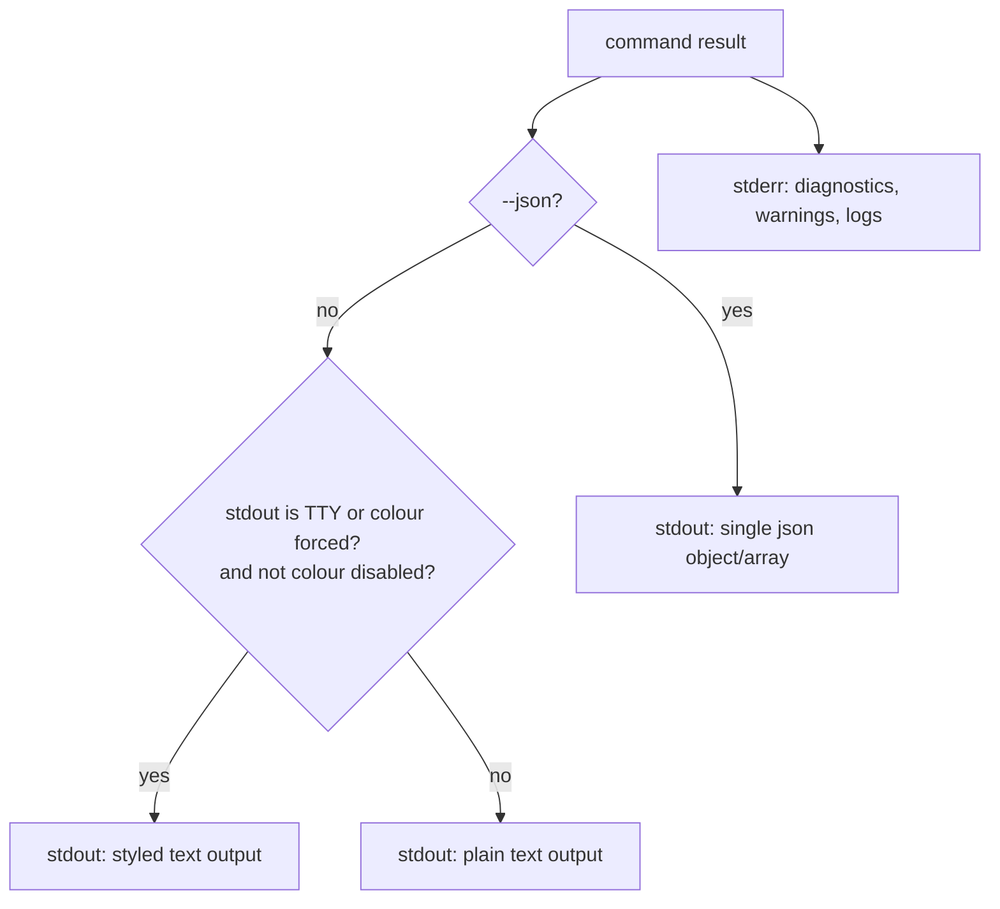

Rules:

- Program data goes to stdout.
- Diagnostics, warnings, progress, and logs go to stderr.
- `--json` emits one JSON value and no extra text on stdout.
- JSON-mode errors are written to stderr as a JSON error envelope.
- `gate doctor --json` is a check/report command: discovered issues are report
  data and are written to stdout even when the command exits non-zero. Usage and
  internal errors still use the JSON error envelope on stderr.
- Rich output is enabled when stdout is a terminal and colour is not disabled.
  `FORCE_COLOR=1` or `CLICOLOR_FORCE=1` forces rich output for non-TTY
  writers. `NO_COLOR` always disables rich output. `CLICOLOR=0` disables default
  TTY colour unless a force variable is set.
- Piped output stays plain and grep-friendly by default.
- Long-running command progress may show a single-line activity indicator on
  stderr only when stderr is an interactive terminal. Activity indicators are
  disabled for JSON mode, redirected stderr, `NO_COLOR`, `CI`, and
  `GATE_NO_INDICATOR`. `FORCE_COLOR` and `CLICOLOR_FORCE` do not force activity
  indicators.
- Activity indicators must stop and clear their line before final success
  output, errors, warnings, interactive prompts, or child-process stdout/stderr
  ownership.

The current presentation layer uses `lipgloss` for terminal/forced-colour
styling and borderless tables, plus `internal/ui` activity indicators for
selected long-running command phases. There is no fullscreen TUI command in the
current public surface. Any future interactive TUI must keep the same output
contract and must not affect non-TTY or JSON behavior.

---

## 13. Exposure Providers

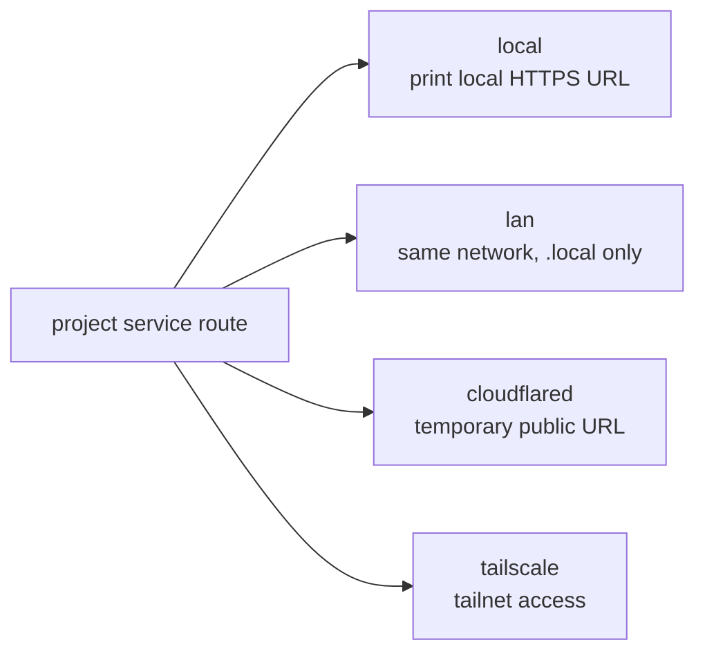

| Provider | Scope | Requirements | Notes |
| --- | --- | --- | --- |
| `local` | Same machine | active route | No external exposure. |
| `lan` | Same network | `.local` domain, reachable machine, trusted CA on clients | gate validates and marks the route exposed; it does not configure other devices' DNS. |
| `cloudflared` | Public temporary URL | `cloudflared` in `PATH` | Prefer `--auth user:pass`; quick tunnel URL is temporary. |
| `tailscale` | Tailnet | logged-in `tailscale` in `PATH` | Uses Tailscale Serve; detailed teardown is handled with Tailscale commands. |

`gate expose` targets one scoped active route. Without a scope flag it resolves
the current project when inside a `gate.toml` tree and global reservations
otherwise.

Security rule: exposing a route is the only way non-loopback clients can pass
the proxy's loopback guard.

---

## 14. Security Model

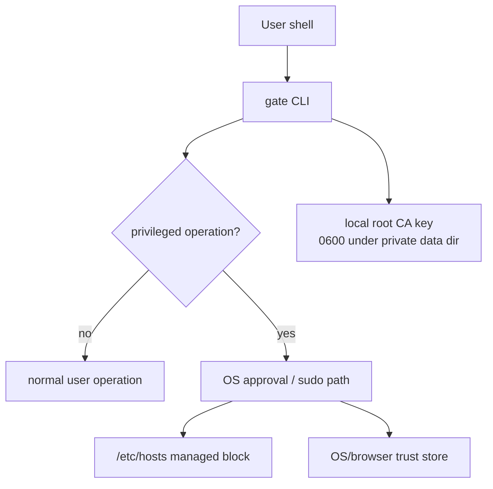

Privileged operations:

| Operation | Why permission can be needed | Guardrail |
| --- | --- | --- |
| Trusting or untrusting root CA | OS/browser trust stores are protected | Trust-store integration is isolated behind seams and uses OS-native mechanisms. |
| Editing `/etc/hosts` | System file | gate edits only its managed block and validates target ownership/symlink state. |
| Binding low ports | `:443` and `:80` can require privileges on some systems | Daemon/service manager owns the listener process. |

Other security properties:

- Root CA private key is local private state.
- Export command writes only the public root certificate.
- Non-loopback clients are blocked unless a route is explicitly exposed.
- Basic auth uses constant-time comparison when configured on an exposed route.
- `internal/truststore` is a vendored, self-contained library and must not import
  gate packages.

---

## 15. Package Architecture

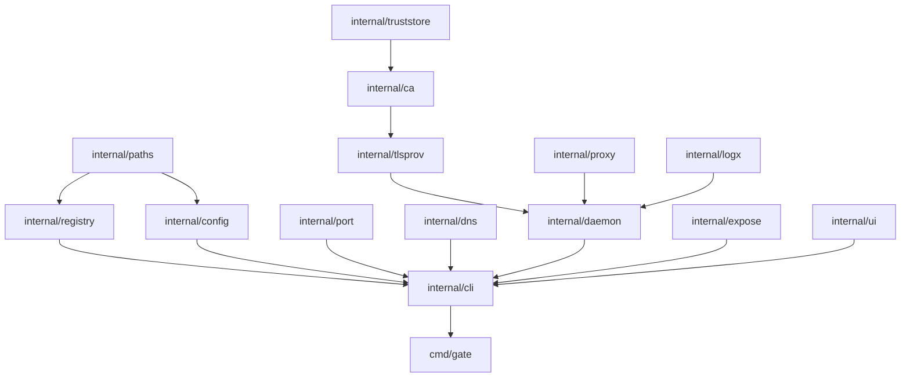

| Package | Responsibility |
| --- | --- |
| `cmd/gate` | Entrypoint, cobra root command, subcommand dispatch, top-level usage. |
| `internal/cli` | Command parsing, command orchestration, text/json output, exit codes. |
| `internal/ui` | Styling helpers and activity indicators. Presentation tier only. |
| `internal/paths` | XDG/macOS config, data, state, and runtime path resolution. |
| `internal/config` | `gate.toml` discovery, parsing, validation, env interpolation, surgical editing. |
| `internal/registry` | Registry schema, conflict checks, file locking, atomic persistence. |
| `internal/port` | Port allocation, liveness checks, `PORT` env injection, child process run behavior. |
| `internal/dns` | DNS mode selection, `.localhost` no-op, hosts-file provider. |
| `internal/ca` | Root CA creation, leaf issuance, trust/export commands. |
| `internal/truststore` | Vendored trust-store implementation. Self-contained, no gate imports. |
| `internal/tlsprov` | TLS provider abstraction, internal CA provider, ACME/DNS-01 flow. |
| `internal/proxy` | Host-routing reverse proxy, TLS termination hooks, route hot reload. |
| `internal/daemon` | Resident process, admin socket API, lifecycle status. |
| `internal/expose` | Local/LAN/Cloudflared/Tailscale exposure providers and auth handling. |
| `internal/logx` | Runtime logging, access logs, rotation. |

Dependency policy:

| Tier | Allowed dependency shape |
| --- | --- |
| Core data plane and security packages | Prefer stdlib and `golang.org/x`; avoid presentation dependencies. |
| Presentation and CLI packages | May use small, targeted libraries such as `cobra`, `go-toml`, and `lipgloss`. |
| Vendored trust-store code | Must stay self-contained and receive gate-specific behavior through generic seams. |

---

## 16. Development Gates

The project command runner is `just`.

| Recipe | Purpose |
| --- | --- |
| `just build` | Build `bin/gate`. |
| `just test` | Run `go test -race ./...`. |
| `just lint-json` | Emit structured lint diagnostics on stdout and text diagnostics on stderr. |
| `just lint` | Run text lint output. |
| `just vuln` | Run `govulncheck ./...`. |
| `just check` | Run tests, lint, and vulnerability scan. Must pass before PR. |
| `just fmt` | Run gofmt and goimports. |

Validation priorities:

- Output contract tests for plain, TTY-gated, forced-colour, `NO_COLOR`, and
  JSON paths.
- Registry concurrency and atomic-write tests.
- Proxy tests for routing, hot reload, loopback guard, auth, 502 classification,
  streaming, and redirects.
- Trust/hosts privileged paths tested through fakes rather than mutating the
  developer or CI machine.
- `internal/truststore` domain separation: no imports from `gate/internal/...`.

---

## 17. Current TUI Scope

The previous TUI documents were planning artifacts. The current implemented
scope is intentionally smaller and is now part of this spec:

| Area | Current state |
| --- | --- |
| Rich CLI usage | Implemented for terminal or forced-colour output through `internal/ui`. |
| Rich tables/status | Implemented as terminal or forced-colour presentation sugar. |
| JSON and pipe output | Plain and stable by default; rich rendering is enabled only when colour is forced. |
| Fullscreen dashboard | Not part of the current command surface. |
| Interactive pickers | Not part of the current command surface. |
| Charts/metrics TUI | Not part of the current command surface. |

If fullscreen or interactive TUI features are added later, they must be specified
in this file before implementation and must preserve the output contract in
section 12.
