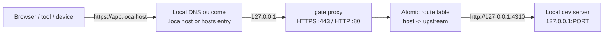
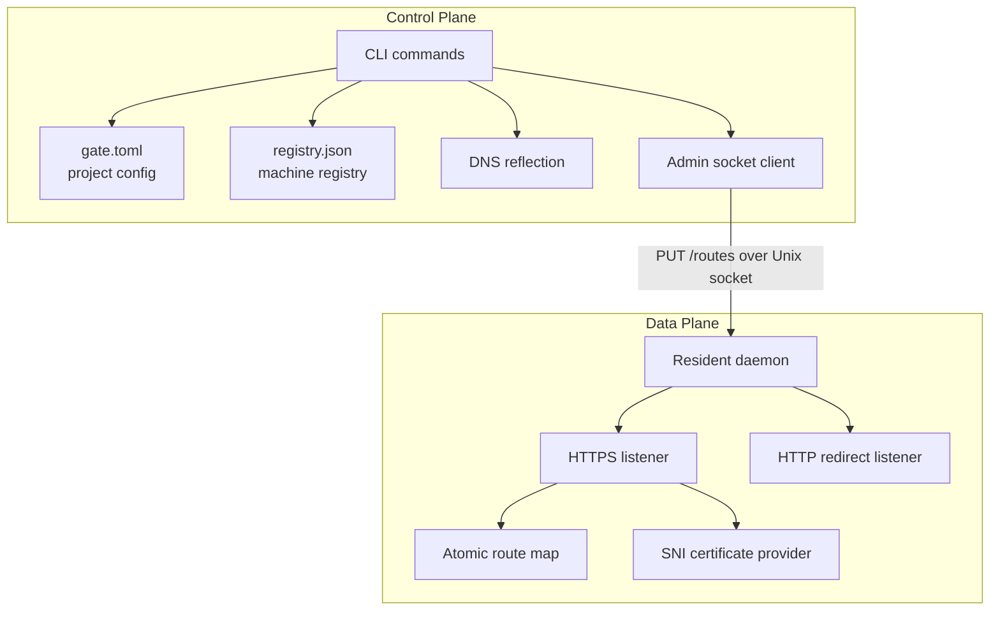
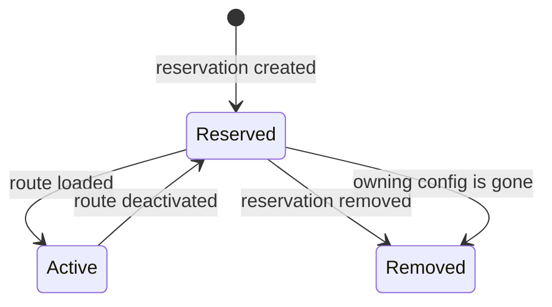
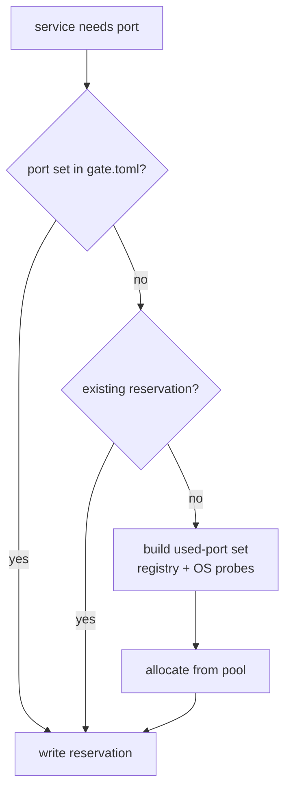
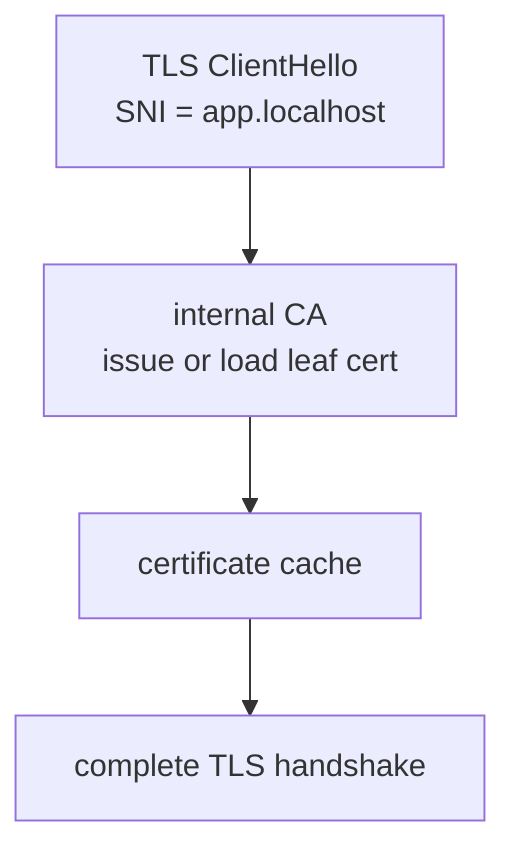
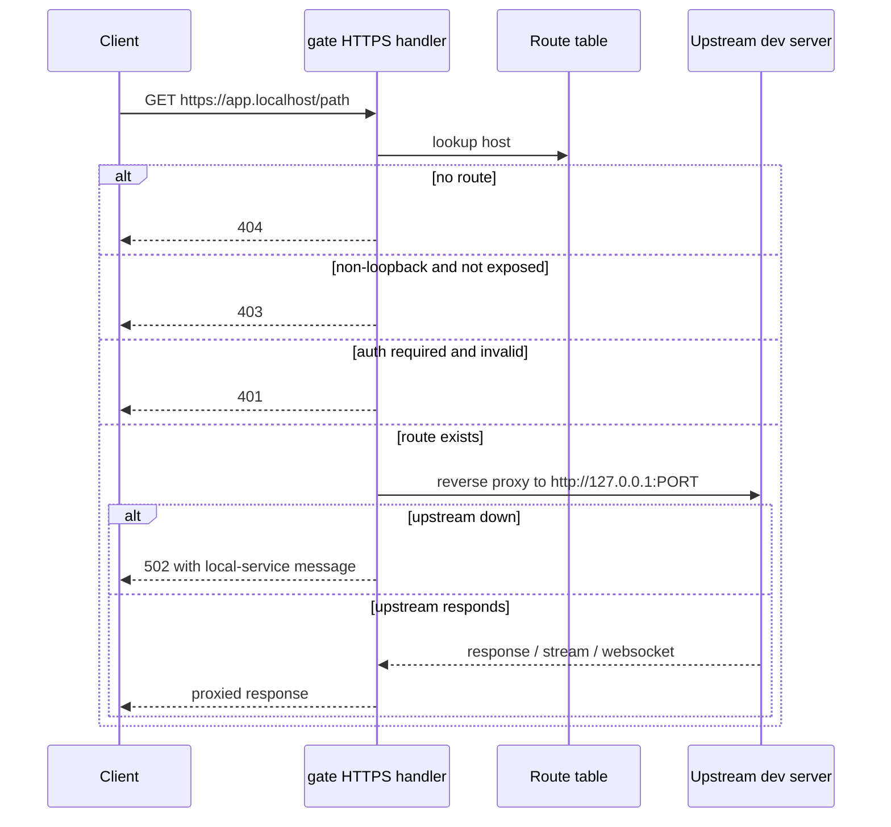
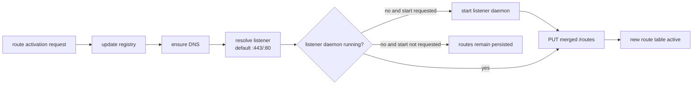
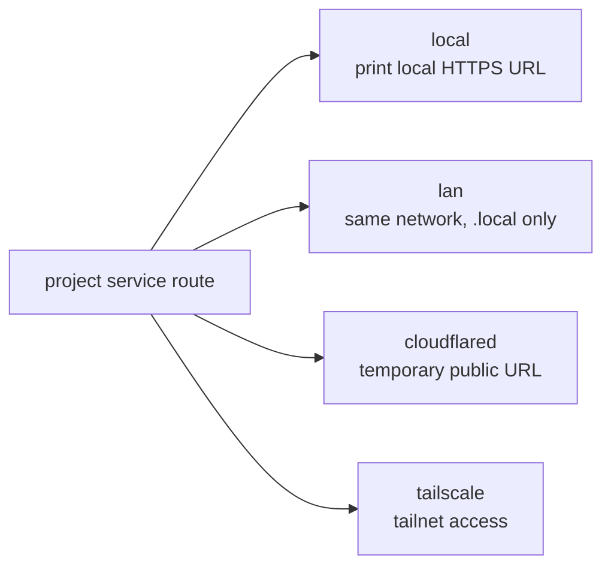
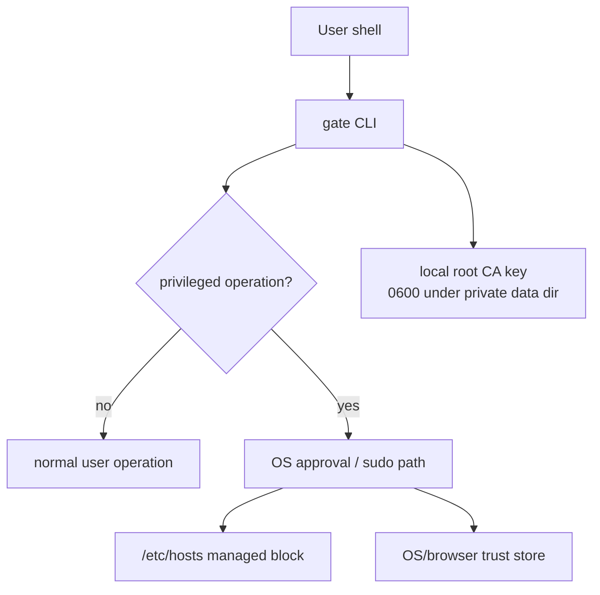
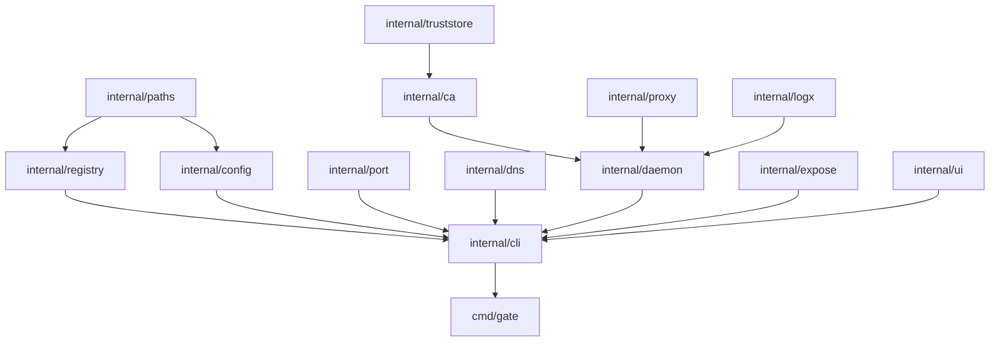

# Specification

`gate` is a local-development HTTPS reverse proxy and port registry, shipped as a
single Go binary. It maps local domains to local dev servers, keeps domain and
port reservations stable across projects, and can expose selected local routes
to other devices for testing.

This document is the product and implementation specification. It defines
system boundaries, state models, security invariants, and architectural
constraints. Exact command syntax, user examples, output fields, and exit codes
belong in [`docs/usage.md`](usage.md); the bundled agent cheat sheet belongs in
[`skills/gate/SKILL.md`](../skills/gate/SKILL.md).

> [!NOTE]
> `gate` is not a production proxy. It is designed for developer machines, local
> services, and temporary test exposure.

---

## 1. Product Boundary

### Goals

| Goal | What gate provides |
| --- | --- |
| Local HTTPS by domain | `https://app.localhost` or a custom local domain routes to a local upstream such as `127.0.0.1:4310`. |
| Stable port assignment | A machine-wide registry reserves ports so projects do not hard-code or guess ports. |
| Project-local config | `gate.toml` is the shareable source of truth for a repository's local routes. |
| Global reservations | A developer can reserve a named domain and port without a project file. |
| Daemon hot reload | A resident proxy can receive new routes without restarting. |
| Script/agent compatibility | Commands keep stdout data separate from stderr diagnostics; JSON output is stable and parseable. |
| Temporary external test access | LAN, Cloudflared, and Tailscale providers can expose selected local services. |

### Non-goals

| Non-goal | Reason |
| --- | --- |
| Production traffic | gate terminates local dev traffic and assumes a developer-controlled machine. |
| Hosted environments | gate is not a server deployment platform. |
| Owning dev server processes | gate can run a child command with `PORT` injected, but it does not manage arbitrary service lifecycles as a process supervisor. |
| Replacing DNS infrastructure | gate only handles local `.localhost`, local hosts-file reflection, and provider-specific exposure workflows. |
| Default public exposure | Any route reachable outside loopback must be explicitly exposed. |

---

## 2. System Overview





The CLI computes desired state from project config and the registry. Daemon
processes are listener-scoped: one daemon owns one HTTPS/HTTP listen address
pair and serves the merged route table for every active reservation targeting
that listener. If the listener daemon is running, the CLI pushes the merged
route table through its admin socket. If it is not running, route reservations
still persist and can be loaded later.

---

## 3. Core Concepts

### Project

A project is a repository with a `gate.toml` file. `gate` discovers the file by
walking upward from the current directory until it finds `gate.toml`, a `.git`
root, the user's home directory, or the filesystem root.

```toml
[project]
name = "myapp"

[services.web]
domain = "app.localhost"

[services.api]
domain = "api.localhost"
port = 3001
```

### Service

A service maps one domain to one upstream port. If a service does not specify a
port, gate allocates one from the default pool and stores the reservation.

### Reservation

A reservation is the persisted binding of `project/service -> domain -> port`.
It survives dev server restarts.



### Active Route

An active route is a reservation currently loaded into the proxy. The `Active`
flag controls whether it is included in the daemon route table. Deactivation
removes routes from the proxy while preserving reservations.

### Liveness

Liveness is not persisted. gate checks whether a dev server is listening by
dialing the reserved upstream. A reserved service can be `down` when no process
is listening.

---

## 4. Project Configuration

`gate.toml` is intentionally small. The common case is a project name plus one
or more service domains. Environment-backed values are available for projects
that need per-developer domains or ports, but they are not required for ordinary
local routing.

### Project Fields

| Field | Type | Default | Meaning |
| --- | --- | --- | --- |
| `name` | string | required | Stable project key used in registry ownership such as `myapp/web`. |
| `env_files` | string array | empty | Dotenv files used only for environment interpolation in service fields. |

`env_files` entries are resolved relative to `gate.toml`. Missing files are
ignored. Process environment values win over dotenv values, and earlier dotenv
files win over later ones.

### Service Fields

| Field | Type | Default | Meaning |
| --- | --- | --- | --- |
| `domain` | string | required | Hostname gate routes. Canonicalized as lowercase without trailing dot. |
| `port` | integer or env string | auto-allocate | Local upstream port. `0` or omitted means allocate from the default pool. |

`domain` and `port` can include environment references through `${NAME}` or
`${NAME:-fallback}`. `${NAME}` is required and fails if unset. `${NAME:-fallback}`
uses the fallback when the variable is unset or empty.

```toml
[project]
name = "myapp"
env_files = [".env.local", ".env"]

[services.web]
domain = "${WEB_DOMAIN:-app.localhost}"
port = "${WEB_PORT:-3000}"
```

---

## 5. Storage Layout


| Data | Owner | Format | Notes |
| --- | --- | --- | --- |
| `gate.toml` | user and CLI | TOML | Shareable project config. Edited surgically so comments and surrounding formatting survive. |
| `registry.json` | gate only | JSON | Machine-wide reservations. Uses schema versioning, advisory file locking, and atomic write by temp file + rename. |
| Admin sockets | daemon | Unix sockets | CLI talks to listener-keyed daemons over a local HTTP API. |
| CA material | gate | PEM files | Root key is private local state and must not be copied. Export only the root certificate. |
| Logs | gate / OS service manager | text or JSONL | Runtime and access logs are separate from command data output. |

Registry schema:

```json
{
  "version": 1,
  "services": {
    "myapp/web": {
      "project": "myapp",
      "service": "web",
      "domain": "app.localhost",
      "port": 4310,
      "tls": "internal",
      "dns": "localhost",
      "active": true,
      "config_path": "/repo/gate.toml"
    },
    "/web": {
      "service": "web",
      "domain": "web.localhost",
      "port": 4301,
      "tls": "internal",
      "standalone": true,
      "active": true
    }
  }
}
```

---

## 6. Port Management

The default allocation pool is owned by `internal/port`. When a service omits
`port`, gate chooses an available port that is not already reserved and is not
currently bound by the OS.



Rules:

- Domains are globally unique on the machine.
- Reserved ports are globally unique on the machine when non-zero.
- Existing reservations keep their ports unless config changes.
- Fixed ports from `gate.toml` win over automatic allocation.
- Port reservation is best-effort; the OS can still let another process bind a
  reserved port while the dev server is down.

---

## 7. DNS Modes

| Mode | When used | Permission | Behavior |
| --- | --- | --- | --- |
| `localhost` | Domains ending in `.localhost` | none | No file changes. Modern resolvers map `.localhost` to loopback. |
| `hosts` | Custom local domains | sudo may be required | gate writes only its managed block in `/etc/hosts`. |

Mode is selected from the domain or explicitly forced by the caller.

```text
# gate managed block
127.0.0.1  app.example.test
127.0.0.1  api.example.test
```

Hosts-file editing is guarded by ownership and symlink checks. Permission
failures must be classified separately from ordinary command failures so callers
can decide whether to request elevated privileges.

---

## 8. TLS



### Internal CA

The default provider creates a local root CA and issues leaf certificates for
local domains. The CLI provides trust, untrust, and root-certificate export
operations so local and peer devices can trust gate-issued certificates when
needed.

Never copy or share the root private key.

---

## 9. Proxy Behavior



Implementation notes:

- Route lookup is by canonical host, excluding any request port.
- Route table reload uses `atomic.Pointer`; new requests see the new table,
  in-flight requests keep their current route.
- HTTP requests on the plaintext listener redirect to HTTPS.
- The reverse proxy preserves streaming behavior with immediate flushing.
- WebSocket, SSE, HMR, and HTTP/2 are treated as ordinary reverse-proxy traffic.
- Non-loopback clients are blocked unless the route has been explicitly exposed.
- Optional per-route basic auth is enforced before proxying.

---

## 10. Daemon and Admin Socket

Each daemon owns one pair of front proxy listeners. The CLI controls each daemon
over a listener Unix-domain socket.



Admin API:

| Method | Path | Purpose |
| --- | --- | --- |
| `GET` | `/status` | Return daemon PID, route count, uptime, and listen addresses. |
| `PUT` | `/routes` | Replace the active route table. |
| `POST` | `/reload` | Reserved reload endpoint; currently reports reload success. |

Only one daemon can own a given HTTPS/HTTP listen address pair. When daemon
startup is requested, the CLI starts or reuses that listener daemon and replaces
older scoped gate daemons that already own the same listener before starting the
listener-keyed daemon.

---

## 11. Command Model

The public CLI is organized around a small set of responsibilities:

| Area | Responsibility |
| --- | --- |
| Project setup | Create and edit project-local routing configuration. |
| Route lifecycle | Reserve ports, activate/deactivate routes, reload listener daemons, and inject `PORT` into child commands. |
| Registry inspection | Inspect scoped reservations, route activation, upstream liveness, and assigned ports. |
| Exposure lifecycle | Create, inspect, and stop temporary exposure records through supported providers. |
| Daemon lifecycle | Start, stop, restart, inspect, and read logs for listener-keyed daemons. |
| Trust and CA | Install, remove, and export the local root CA. |
| Maintenance | Diagnose, repair, prune, upgrade, uninstall, and generate shell completion. |

Exact command syntax, examples, exit codes, and output-field meanings are
documented in [`docs/usage.md`](usage.md). This spec only constrains behavior
that affects the product model or implementation invariants.

Scope selectors are mutually exclusive. Without an explicit scope, commands use
the current project when a `gate.toml` is discoverable; otherwise they use the
global scope. Commands that remove one reservation operate on a selected
service/name; commands that clear an entire scope require an explicit
non-interactive confirmation path.

Shell completion is read-only. It may inspect local registry and project config
state, but it must not start daemons, modify DNS, trust certificates, or write
files. Missing or invalid local state should produce no candidates rather than
shell-visible errors.

---

## 12. Output Principles

Automation compatibility is a product invariant:

- Program data goes to stdout.
- Diagnostics, warnings, progress, and logs go to stderr.
- Machine-readable output must not be decorated with terminal styling or
  progress indicators.
- Terminal presentation may improve human readability, but it must not change
  non-TTY or machine-readable behavior.
- Long-running progress indicators must not interfere with final output,
  errors, prompts, or child-process stdio ownership.

Detailed JSON behavior, text examples, environment-variable controls, and exit
codes are usage-document responsibilities.

---

## 13. Exposure Providers



| Provider | Scope | Requirements | Notes |
| --- | --- | --- | --- |
| `local` | Same machine | active route | No external exposure. |
| `lan` | Same network | `.local` domain, reachable machine, trusted CA on clients | gate validates and marks the route exposed; it does not configure other devices' DNS. |
| `cloudflared` | Public temporary URL | `cloudflared` in `PATH` | Requires authenticated exposure or an explicit unauthenticated opt-out; quick tunnel URL is temporary. |
| `tailscale` | Tailnet | logged-in `tailscale` in `PATH` | Uses Tailscale Serve; detailed teardown is handled with Tailscale commands. |

Exposure activation targets one scoped active route. Without an explicit scope,
it resolves the current project when inside a `gate.toml` tree and global
reservations otherwise.

Security rule: exposing a route is the only way non-loopback clients can pass
the proxy's loopback guard.

Exposure records persist whether auth was enabled, but never persist the
`user:pass` secret. Auth secrets are session-scoped and must be supplied again
when a provider route needs to be reloaded after the secret is gone.

---

## 14. Security Model



Privileged operations:

| Operation | Why permission can be needed | Guardrail |
| --- | --- | --- |
| Trusting or untrusting root CA | OS/browser trust stores are protected | Trust-store integration is isolated behind seams and uses OS-native mechanisms. |
| Editing `/etc/hosts` | System file | gate edits only its managed block and validates target ownership/symlink state. |
| Binding low ports | `:443` and `:80` can require privileges on some systems | Daemon/service manager owns the listener process. |

Other security properties:

- Root CA private key is local private state.
- Export command writes only the public root certificate.
- Non-loopback clients are blocked unless a route is explicitly exposed.
- Basic auth uses constant-time comparison when configured on an exposed route.
- `internal/truststore` is a vendored, self-contained library and must not import
  gate packages.

---

## 15. Package Architecture



| Package | Responsibility |
| --- | --- |
| `cmd/gate` | Entrypoint, cobra root command, subcommand dispatch, top-level usage. |
| `internal/cli` | Command parsing, orchestration, output routing, and error classification. |
| `internal/ui` | Styling helpers and activity indicators. Presentation tier only. |
| `internal/paths` | XDG/macOS config, data, state, and runtime path resolution. |
| `internal/config` | `gate.toml` discovery, parsing, validation, env interpolation, surgical editing. |
| `internal/registry` | Registry schema, conflict checks, file locking, atomic persistence. |
| `internal/port` | Port allocation, liveness checks, `PORT` env injection, child process run behavior. |
| `internal/dns` | DNS mode selection, `.localhost` no-op, hosts-file provider. |
| `internal/ca` | Root CA creation, leaf issuance, trust/export commands. |
| `internal/truststore` | Vendored trust-store implementation. Self-contained, no gate imports. |
| `internal/proxy` | Host-routing reverse proxy, TLS termination hooks, route hot reload. |
| `internal/daemon` | Resident process, admin socket API, lifecycle status. |
| `internal/expose` | Local/LAN/Cloudflared/Tailscale exposure providers and auth handling. |
| `internal/logx` | Runtime logging, access logs, rotation. |

Dependency policy:

| Tier | Allowed dependency shape |
| --- | --- |
| Core data plane and security packages | Prefer stdlib and `golang.org/x`; avoid presentation dependencies. |
| Presentation and CLI packages | May use small, targeted libraries such as `cobra`, `go-toml`, and `lipgloss`. |
| Vendored trust-store code | Must stay self-contained and receive gate-specific behavior through generic seams. |

---

## 16. Development Gates

The project command runner is `just`.

| Recipe | Purpose |
| --- | --- |
| `just build` | Build `bin/gate`. |
| `just test` | Run `go test -race ./...`. |
| `just lint-json` | Emit structured lint diagnostics on stdout and text diagnostics on stderr. |
| `just lint` | Run text lint output. |
| `just vuln` | Run `govulncheck ./...`. |
| `just check` | Run tests, lint, and vulnerability scan. Must pass before PR. |
| `just fmt` | Run gofmt and goimports. |

Validation priorities:

- Output contract tests for plain, TTY-gated, forced-colour, `NO_COLOR`, and
  JSON paths.
- Registry concurrency and atomic-write tests.
- Proxy tests for routing, hot reload, loopback guard, auth, 502 classification,
  streaming, and redirects.
- Trust/hosts privileged paths tested through fakes rather than mutating the
  developer or CI machine.
- `internal/truststore` domain separation: no imports from `gate/internal/...`.

---

## 17. Current TUI Scope

The previous TUI documents were planning artifacts. The current implemented
scope is intentionally smaller and is now part of this spec:

| Area | Current state |
| --- | --- |
| Rich CLI usage | Implemented for terminal or forced-colour output through `internal/ui`. |
| Rich tables/status | Implemented as terminal or forced-colour presentation sugar. |
| JSON and pipe output | Plain and stable by default; rich rendering is enabled only when colour is forced. |
| Fullscreen dashboard | Not part of the current command surface. |
| Interactive pickers | Not part of the current command surface. |
| Charts/metrics TUI | Not part of the current command surface. |

If fullscreen or interactive TUI features are added later, they must be specified
in this file before implementation and must preserve the output principles in
section 12.
