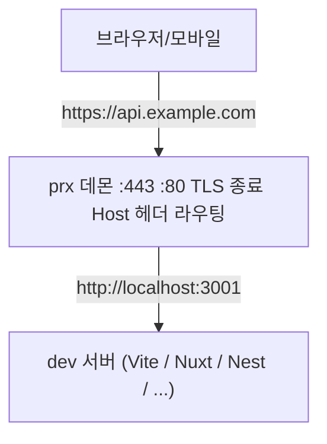
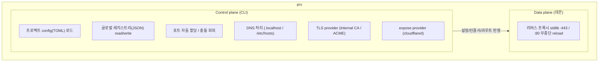

# prx

> 로컬 개발용 글로벌 HTTPS 리버스 프록시 + 포트 레지스트리. 단일 Go 바이너리.

`prx`는 임의의 로컬 도메인을 신뢰된 HTTPS로 `localhost`의 개발 서버에 연결해 주고,
머신 전역에서 포트 할당을 관리하며, 필요할 때 외부(모바일·타기기)로 노출까지 해 주는
독립 실행형 CLI 도구다.

> **상태:** 설계 단계. 이 문서는 구현 전 설계 명세다.

---

## 1. 목적 (Why)

로컬 개발 환경에서 HTTPS 도메인을 쓰려면 보통 프로젝트마다 `docker` + `nginx`(또는
`mkcert` 수동 설정)로 리버스 프록시를 구성한다. 이 방식은 다음 문제를 낳는다.

- **파편화** — 프로젝트마다 nginx 설정·인증서 발급·docker compose가 복붙되며 제각각 갈라진다.
- **포트 충돌** — 새 프로젝트를 띄울 때마다 다른 프로젝트와 겹치지 않는 포트를 손으로 골라야 하고,
  그 포트가 코드·설정에 하드코딩된다.
- **무거움** — HTTPS 프록시 하나 때문에 docker 데몬이 상시 떠 있어야 한다.
- **외부 노출의 임시방편** — 모바일이나 다른 기기에서 테스트하려면 매번 ngrok 등을 즉석에서 붙인다.

`prx`는 이 모든 것을 **머신당 하나의 도구**로 통합한다. 프로젝트는 "어떤 도메인을 어떤
서비스에 연결할지"만 선언하면 되고, 포트 선정·인증서·프록시·외부 노출은 `prx`가 책임진다.

## 2. 무엇을 위해 존재하나 (목표)

1. **임의의 로컬 도메인을 신뢰된 HTTPS로 serving한다.** 브라우저 경고 없이
   `https://app.example.com` → `http://localhost:3000`.
2. **포트를 전역적으로 관리한다.** 프로젝트 간 포트 충돌을 자동으로 회피하고, 포트를
   코드에 박지 않아도 되게 한다.
3. **독립적이고 확장 가능하다.** 외부 바이너리 의존 없는 단일 바이너리. 외부 노출 방식 등은
   플러그인처럼 끼울 수 있다.
4. **AI 에이전트가 다루기 쉽다.** 모든 명령이 스크립트·LLM 친화적이며, 표준 레지스트리
   (skills.sh·apm)로 에이전트용 skill을 배포한다.

### 비목표 (Non-goals)

- 프로덕션 트래픽 처리 / 공개 서버 운영 — 어디까지나 **로컬 개발용**이다.
- dev 서버 자체의 실행·프로세스 관리 — `prx`는 프록시·라우팅·포트만 책임진다.
  (dev 서버는 사용자가 `prx`가 할당한 포트를 받아 직접 띄운다.)

## 3. 동작 개요



- **DNS** — 도메인을 `127.0.0.1`로 해석시킨다. 두 가지 모드 제공 (§6).
- **TLS** — 도메인별 인증서를 제공한다. 로컬 CA 자가발급 또는 ACME 실인증서 중 선택 (§7).
- **Proxy** — 표준 라이브러리 리버스 프록시가 HTTP/2·WebSocket·SSE·HMR(hot reload)을 그대로 통과시킨다.
- **:80** — 평문 HTTP 요청은 동일 호스트의 HTTPS로 301 리다이렉트한다(HSTS는 로컬 특성상 미적용).

## 4. 아키텍처



**설계 원칙: 런타임 외부 바이너리 의존 0, 하드 서드파티 의존 최소.** 프록시·TLS 서버·로컬 CA·인증서
발급은 모두 Go 표준 라이브러리로 구현한다. OS·브라우저별 트러스트 스토어 등록만은 OS 네이티브
도구를 1회성으로 호출한다.

| 영역 | 구현 | 의존 |
| ---- | ---- | ---- |
| 리버스 프록시 | `net/http/httputil` | stdlib |
| TLS 서버 / 동적 SNI | `crypto/tls` | stdlib |
| 로컬 CA·leaf 발급 | `crypto/x509` | stdlib |
| 트러스트 스토어 등록 | `smallstep/truststore` vendored fork (`os/exec`로 OS 도구 호출) | vendoring(internal, Apache-2.0) (internal TLS 전용) |
| ACME (실인증서) | `golang.org/x/crypto/acme` | Go 공식 확장 (acme TLS 전용) |
| DNS-01 챌린지 | provider HTTP API 직접 호출 | stdlib (pluggable) |

→ core(프록시·TLS·CA·라우팅)는 upstream 서드파티 모듈 의존이 없다. 표준 라이브러리와 Go 공식
확장(`golang.org/x`)으로 충당하고, 트러스트 등록은 `smallstep/truststore`를 저장소에 vendoring한
internal fork(Apache-2.0)로 처리한다 — 검증된 NSS·OS 스토어 로직을 모듈 의존 없이 확보하고
필요한 부분만 수정한다. 트러스트 등록은 `internal` TLS를 쓸 때만, 그것도 1회 `prx trust` 시점에만
OS 도구를 부른다.

### 언어 선택: Go

- 단일 정적 바이너리, 런타임 의존성 0, `GOOS`/`GOARCH` 무설정 크로스컴파일.
- 표준 라이브러리만으로 리버스 프록시·TLS·인증서 발급을 구현할 수 있어 외부 의존을 최소화한다.

## 5. 설정 모델 — 2층 구조

설정을 **사람이 쓰는 것**과 **도구가 쓰는 것**으로 분리한다.

### 5.1 프로젝트 config (TOML, git 커밋 대상)

프로젝트 루트의 `prx.toml`. 사람이 선언적으로 작성하며 주석으로 의도를 남긴다.

```toml
# prx.toml
[project]
name = "myapp"

[services.web]
domain = "app.example.com"
# port 생략 → prx가 자동 할당

[services.api]
domain = "api.example.com"
port = 3001          # 고정이 필요하면 명시

[services.admin]
domain = "admin.example.com"
```

TOML은 주석과 섹션 구조를 지원해 사람이 직접 편집·관리하기에 적합하다. 설정은 선언적 매핑만
담는다.

**`prx.toml`이 프로젝트의 단일 진실 공급원이다.** 명령형 `prx add`/`prx rm`은 레지스트리만
건드리지 않고 `prx.toml`에도 함께 써넣어, 손편집과 명령형 추가가 같은 파일로 수렴하게 한다(git에
그대로 남아 팀 공유 가능). 프로젝트 밖(projectless)에서의 임시 추가만 레지스트리에 `adhoc`으로
기록한다.

### 5.2 글로벌 레지스트리 (JSON, 도구 전용)

`~/.config/prx/registry.json`. **도구만 read/write**하며 사람은 직접 만지지 않는다.

- 머신 내 모든 프로젝트의 `도메인 ↔ 포트 ↔ 서비스` 할당 상태를 영속화한다.
- 포트 자동 할당 시 이 레지스트리를 조회해 사용 중인 포트를 피하고, 새로 잡은 포트를 reserve한다.
- AI·스크립트는 파일을 직접 읽지 않고 `prx ls --json`으로 조회한다 (JSON이라 파싱이 안정적).
- **동시성·무결성:** read-modify-write는 advisory 파일 락(`flock`)으로 직렬화하고, temp 파일 작성 후 rename으로 원자적으로 기록한다. 스키마에 `version` 필드를 둬 이후 마이그레이션에 대비한다.

## 6. DNS 처리 — 두 모드 제공

사용자가 상황에 맞게 두 모드 중 고른다.

### 모드 A — sudo 없는 `.localhost` (기본)

`*.localhost` 도메인은 OS·브라우저가 자동으로 `127.0.0.1`로 해석한다. `/etc/hosts`를
건드릴 필요가 없으므로 **sudo가 필요 없다**.

```toml
[services.api]
domain = "api.project.localhost"   # /etc/hosts 수정 불필요
```

- 장점: 권한 상승 없음, 설정 0.
- 한계: 도메인이 `.localhost`로 끝나야 한다.

### 모드 B — 커스텀 도메인 + `/etc/hosts` (sudo 필요)

`app.example.com`처럼 실제 도메인꼴을 쓰려면, 해당 호스트를 `127.0.0.1`로 보내도록
`/etc/hosts`에 항목을 추가해야 한다. `prx`가 항목을 자동으로 add/remove하지만, 파일 편집에
**sudo가 필요**하다.

```
# prx가 관리하는 블록
127.0.0.1  app.example.com      # prx:myapp:web
127.0.0.1  api.example.com      # prx:myapp:api
```

- 장점: 원하는 어떤 도메인이든 사용 가능.
- 비용: 도메인 add/rm 시 sudo. `prx`는 자신이 관리하는 블록만 안전하게 편집한다.

> 모드는 도메인 형태로 자동 판별하거나 `--dns localhost|hosts`로 명시한다.

## 7. TLS — provider 두 종류

인증서 발급 방식을 추상화해 서비스별로 고른다.

### `internal` — 로컬 CA (기본)

`prx`가 루트 CA를 자가발급하고, 도메인별 leaf 인증서를 SNI에 맞춰 발급한다. 루트 CA를 OS
트러스트 스토어에 한 번 등록(`prx trust`)하면 브라우저 경고가 사라진다. 오프라인에서 동작하며
도메인 형태에 제약이 없다(`.localhost`·커스텀 모두 가능).

- 한계: 다른 기기(모바일 등)에서 신뢰하게 하려면 그 기기에도 루트 CA를 설치해야 한다.

### `acme` — 실인증서

실제 소유한 도메인에 대해 ACME DNS-01 챌린지로 공인 CA의 신뢰 인증서를 발급받는다. 트러스트
스토어 등록이 **불필요**하고, 모바일을 포함한 어떤 기기에서도 경고 없이 신뢰된다.

- DNS-01 방식이라 인바운드 포트를 열 필요가 없다(로컬 머신이 DNS 레코드로만 챌린지를 증명).
- 실소유 도메인과 DNS provider 자격증명이 필요하다. DNS provider는 플러그인형으로 확장한다.
- **갱신은 데몬 모드에서만 자동화된다.** 데몬이 백그라운드 갱신 루프를 돌려 만료 잔여 30일 미만 시
  재발급한다. on-demand 모드는 `prx up` 시점에 기회적으로 갱신하므로, `acme`는 사실상 데몬 모드를
  권장한다. 발급 검증·rate limit 회피용으로 `--acme-staging`(Let's Encrypt 스테이징)을 둔다.

```toml
[services.web]
domain = "app.example.com"
tls = "internal"                   # 기본

[services.api]
domain = "api.dev.example.com"     # 실소유 도메인
tls = "acme"
acme_dns = "cloudflare"            # DNS-01 provider
```

> 두 방식을 프로젝트 내에서 서비스별로 혼용할 수 있다.

## 8. 실행 모델 — 두 방식 제공

### 데몬 모드 (상주)

`prx` 프록시가 백그라운드에 상주하며 `:443`/`:80`을 듣는다. `launchd`(macOS) /
`systemd`(Linux)로 부팅 시 자동 기동할 수 있다. 여러 프로젝트를 동시에 항상 띄워 두는 데 적합.

```
prx daemon start        # 상주 시작
prx daemon stop
prx daemon status
prx daemon logs -f
```

### on-demand 모드 (포그라운드)

데몬을 상주시키지 않고, 필요할 때 포그라운드로 띄웠다가 끝나면 내린다. 단발성 작업·CI·가벼운
사용에 적합.

```
prx up --foreground     # 현재 프로젝트만 띄우고 Ctrl-C로 종료
```

> 어느 쪽이든 같은 레지스트리·인증서·라우팅을 공유한다. 사용자가 선택한다.

### `:443` 단일 소유 + admin 소켓

`:443`/`:80`을 듣는 프록시는 한 시점에 하나만 존재한다. control-plane(CLI)은 unix 도메인
소켓 admin API(`~/.config/prx/prx.sock`)로 데이터 plane과 통신한다.

- `prx up` = ① 레지스트리·`prx.toml` 갱신 → ② 데몬이 떠 있으면 소켓으로 라우트를 push해 **핫
  reload** → ③ 데몬이 없으면 현재 프로젝트만 on-demand 포그라운드로 기동.
- 데몬 상주 중 `prx up --foreground`는 `:443` 충돌이므로 거부한다(exit 4). 데몬을 무시하고
  독립 프록시를 강제로 띄우려면 `--standalone`을 명시한다.

### reload 메커니즘 — 핫 reload

전체 재기동은 WebSocket·HMR 커넥션을 끊어 dev UX를 해친다. 따라서 데몬은 무중단으로 라우트
테이블을 교체한다: 핸들러를 `atomic.Pointer`로 스왑하고, 인증서는 `tls.Config.GetCertificate`
콜백이 live 캐시를 조회하게 한다. 기존 커넥션은 graceful drain한다.

## 9. 포트 관리 (핵심 가치)

- `prx.toml`에서 `port`를 생략하면, `prx`가 글로벌 레지스트리를 보고 **빈 포트를 자동
  할당**한 뒤 영속화한다. 다음에 띄워도 같은 포트가 유지된다.
- dev 서버는 할당된 포트를 주입받아 사용한다. 1순위는 `prx run`이 자식 프로세스의 env에
  `PORT`를 넣어 exec하는 방식으로, 파일을 건드리지 않아 사용자 `.env` 클로버 위험이 없다.

  ```bash
  prx run web -- pnpm dev          # PORT=4310 주입 후 자식 exec (권장)
  PORT=$(prx port web) pnpm dev    # 수동/CI용
  ```

  `.env` 자동 기록은 덮어쓰기 사고 위험이 있어 기본 비활성이며, 필요 시 `--write-env`로 opt-in한다.
- **할당 풀**은 기본 `4300–4999`(흔한 dev 포트 3000·5173·8080과 OS ephemeral 49152+ 회피).
  global config로 변경 가능하며, 할당 시 레지스트리 예약분과 현재 OS 바인딩(probe)을 모두 피한다.
- **도메인은 머신 전역에서 유일하다.** `prx up`이 다른 프로젝트가 이미 점유한 도메인을 만나면
  점유 프로젝트를 알리며 거부한다(exit 4).
- 결과: **포트 하드코딩 제거, 수동 선정 제거, 프로젝트 간 충돌 자동 회피.** 한 머신의 로컬
  개발 포트를 단일 레지스트리가 관장한다.

### 예약(reservation) vs 활성(liveness)

두 개념을 분리한다.

- **예약** — 레지스트리에 `서비스 ↔ 포트`가 고정된 상태. **영속적**이며 dev 서버 프로세스
  수명과 무관하다. `pnpm dev`가 종료돼도 예약은 유지되어, 다음에 다시 띄우면 같은 포트를 받는다.
- **활성** — 그 포트에서 dev 서버가 실제로 listen 중인지 여부. 프로세스가 죽으면 비활성이 된다.
  `prx`는 dev 서버의 부모가 아니므로 프로세스를 관측하지 않고, `localhost:port`로 TCP 연결을 시도해 활성 여부를 판정한다(`prx ls`의 STATUS·프록시의 502 분기에 사용).

`prx`는 dev 서버의 부모 프로세스가 아니므로(§2 비목표) 임의 프로세스의 종료를 신뢰성 있게
관측하지 않는다. 따라서 **포트 예약은 프로세스 종료로 자동 회수되지 않는다.** 이는 포트 안정성을
위한 의도된 설계다.

### 예약 회수 (정리)

예약은 명시적 명령 또는 GC로만 회수한다.

| 명령          | 동작                                                         |
| ------------- | ------------------------------------------------------------ |
| `prx down`    | 현재 프로젝트의 라우트를 비활성화한다 (예약은 보존).         |
| `prx rm <svc>`| 특정 서비스의 예약을 삭제한다.                               |
| `prx prune`   | GC — `prx.toml`이 사라진(삭제된) 프로젝트의 예약 등을 회수한다. |

### 한계

- 예약은 `prx` 내부의 약속일 뿐 OS가 강제하는 점유가 아니다. dev 서버가 비활성인 동안 다른
  앱이 그 포트를 OS 레벨에서 바인딩할 수 있다. 그래서 자동 할당은 **best-effort**로, 현재
  live인 포트와 예약된 포트를 모두 피해 새 포트를 고른다.
- 대상 서비스가 비활성일 때 해당 도메인으로 접속하면 `prx`는 502와 함께 "서비스 미기동"을 안내한다.

## 10. 외부 노출 — 플러그인형 provider

로컬을 넘어 모바일·타기기에서 테스트할 수 있도록, 노출 방식을 추상화해 끼운다.

| provider          | 용도                    | TLS 신뢰              |
| ----------------- | ----------------------- | --------------------- |
| `local` (기본)    | 내 머신만               | 내장 CA               |
| `lan`             | 같은 Wi-Fi의 다른 기기  | 기기에 CA 수동 설치   |
| `cloudflared`     | 공개 URL (모바일 등)    | 진짜 신뢰 (Cloudflare)|
| `tailscale`       | 사설 기기망 공유        | Tailscale 자동        |

```bash
prx expose api --via cloudflared     # 공개 URL 발급
prx expose api --via tailscale
```

- provider는 인터페이스로 추상화되어 이후 ngrok 등 추가가 쉽다.
- **`lan` provider는 mDNS(Bonjour/avahi)로 광고하므로 도메인이 `<name>.local` 꼴이어야 한다.**
  임의 도메인을 LAN 공유하려면 타기기 `/etc/hosts`를 수동 설정한다. 어느 쪽이든 타기기에는
  `prx ca export`로 받은 루트 CA를 설치해야 신뢰된다.
- **expose는 dev 서버를 로컬 밖으로 연다 — URL을 아는 누구나 접근 가능하다.** 기본은 경고를
  출력하고, `--auth`로 프록시 레벨 basic auth(또는 cloudflared Access)를 강제할 수 있다.
  expose된 라우트에 한해 §12의 "비로프백 차단" 예외가 적용된다.

## 11. AI 에이전트 친화

- **모든 명령에 `--json` 출력**과 non-interactive 플래그 제공 → 에이전트가 안정적으로 파싱·호출.
- **[agentskills.io](https://agentskills.io/) 규격 skill 폴더(`skills/prx/SKILL.md`) 동봉.**
  skill을 자기 폴더에 격리해 repo 루트는 순수 Go 프로젝트로 유지한다. 배포·설치는 자체 인스톨러를
  만들지 않고 표준 레지스트리에 위임하며, 한 repo가 두 경로를 모두 커버한다.
  - [skills.sh](https://www.skills.sh/): `npx skills add jinyongp/prx`
  - [apm](https://github.com/microsoft/apm): `apm install jinyongp/prx`
  - (`apm.yml`은 prx를 의존성으로 쓰는 *소비자 프로젝트*가 두는 매니페스트이지 prx repo 산출물이 아니다.)
  - 설치하면 AI가 `prx`의 사용법을 곧바로 익히고 `prx add`·`prx run` 등을 직접 실행한다.
  - 바이너리엔 인스톨러 코드를 두지 않고, 수동 설치·디버그용으로 동봉 경로만 출력하는
    `prx skill path`를 둔다.
- 저장소에 `AGENTS.md`를 두어 에이전트 진입점을 명확히 한다.

## 12. 보안 — sudo 경계

권한 상승은 최소화하되, 불가피한 지점을 명시하고 안전하게 다룬다.

| 동작                       | sudo 필요          | 비고                              |
| -------------------------- | ------------------ | --------------------------------- |
| 루트 CA를 OS 트러스트에 등록 | 1회 (`prx trust`)  | keychain/트러스트 스토어 프롬프트 |
| `/etc/hosts` 편집          | 모드 B에서만       | `prx`가 관리하는 블록만 편집      |
| `:443` / `:80` 바인딩      | 데몬 기동 시       | `launchd`/`systemd`로 위임 가능   |
| `.localhost` 사용 (모드 A) | 불필요             | 권장 기본값                       |

- **권한 경계 하드닝:** sudo 호출 전 대상 파일의 소유권·심볼릭 링크를 검증한다.
- **비로프백 요청 차단:** 외부에 명시적으로 노출하지 않은 라우트로 들어오는 비-loopback 요청은
  거부한다.
- **CA 개인키 보호:** 루트 CA 개인키는 데이터 디렉터리에 `0600`(상위 디렉터리 `0700`)으로 저장한다.
  키가 유출되면 임의 도메인에 대한 MITM이 가능하므로 권한·반출을 엄격히 다룬다.

## 13. 사용 흐름 예시

```bash
# 0) 최초 1회 — 루트 CA를 트러스트 스토어에 등록
prx trust

# 1) 프로젝트에 prx.toml 작성 (위 §5.1 참고)

# 2) 서비스 등록 + 프록시 반영
prx up

# 3) 할당된 포트로 dev 서버 기동 (PORT 자동 주입)
prx run web -- pnpm dev

#    → https://app.example.com 접속 가능 (신뢰된 HTTPS)

# 4) 현재 매핑 확인
prx ls
prx ls --json        # 스크립트/AI용

# 5) 모바일에서 테스트
prx expose web --via cloudflared

# 6) 정리
prx down
```

### 명령 표면 (초안)

```
prx up [--foreground] [--standalone] [--config prx.toml] [--dns localhost|hosts] [--write-env] [--access-log]
prx down
prx ls [--json]
prx run <service> -- <cmd...>            # PORT 주입 후 자식 exec
prx add <domain> <port>                  # prx.toml + 레지스트리에 기록
prx rm <domain>
prx prune
prx port <service>
prx daemon start|stop|status|logs [--access] [-f]
prx trust
prx ca export [--out <path>]             # 타기기 설치용 루트 CA 반출
prx expose <service> --via <provider> [--auth]
prx skill path                           # 동봉 SKILL.md 경로 출력 (설치는 skills.sh/apm)
prx uninstall
```

### 출력 규약

모든 명령은 두 가지 표현을 가진다.

- **기본(human)** — 사람이 읽기 좋은 표/라인. 데이터는 stdout, 로그·진단은 stderr.
- **`--json`** — 안정된 스키마의 JSON 한 덩어리를 stdout으로. 에이전트·스크립트용.

공통 규칙:

- 데이터는 stdout, 로그/진행 메시지는 stderr로 분리한다(파이프 안전).
- `--json`은 단일 객체 또는 배열만 출력한다(부가 텍스트 없음).
- 종료 코드: `0` 성공, `1` 일반 오류, `2` 사용법 오류, `3` 권한 부족(sudo 필요), `4` 포트/도메인 충돌.

#### 로그

로그는 데이터 출력과 분리된 별도 스트림이며 3종이다.

- **CLI 진단** — 명령 실행 메시지·경고. 항상 stderr (위 공통 규칙).
- **데몬 런타임 로그** — 기동·라우트 reload·인증서 발급/갱신·에러.
  - 기본 사람용 라인, `--log-format json`(또는 `PRX_LOG=json`) 시 JSONL. 레벨 info 기본,
    `--verbose`=debug. TTY면 색상, 파이프면 끈다.
  - 포그라운드는 stderr로 낸다. service manager(`systemd`/`launchd`) 기동 시 stdout/stderr로
    내보내 journald/launchd에 위임하고, 직접(manual) 데몬일 때만 state 디렉터리의 `prx.log`에 기록한다.
  - `prx daemon logs [-f]`는 OS를 판별해 파일 tail 또는 `journalctl` 래핑을 단일 인터페이스로 제공한다.
- **접근 로그(access)** — 요청별 기록. dev 노이즈를 피해 **기본 비활성**이며 `prx up --access-log`
  또는 `prx.toml`의 `[log] access = true`로 켠다. 켜면 요청당 JSONL 한 줄을 낸다.

  ```json
  { "ts": "2026-05-31T10:00:00Z", "host": "app.example.com", "method": "GET",
    "path": "/api", "status": 200, "dur_ms": 12, "upstream": "127.0.0.1:4310",
    "bytes": 3344, "proto": "h2" }
  ```

  `prx daemon logs --access -f`로 tail한다.

로그 파일은 외부 logrotate 의존 없이 내장 size 회전(기본 10MB×3)으로 관리한다.

#### `prx ls`

```
$ prx ls
PROJECT  SERVICE  DOMAIN            PORT   TLS       STATUS
myapp    web      app.example.com   4310   internal  ● live
myapp    api      api.example.com   3001   internal  ○ down
demo     web      demo.localhost    4311   internal  ● live
```

```
$ prx ls --json
{
  "services": [
    { "project": "myapp", "service": "web", "domain": "app.example.com",
      "port": 4310, "tls": "internal", "dns": "hosts", "status": "live" },
    { "project": "myapp", "service": "api", "domain": "api.example.com",
      "port": 3001, "tls": "internal", "dns": "hosts", "status": "down" }
  ]
}
```

#### `prx up`

```
$ prx up
✓ myapp/web   app.example.com → :4310  (internal, hosts)
✓ myapp/api   api.example.com → :3001  (internal, hosts)
proxy reloaded · 2 routes active
```

```
$ prx up --json
{ "project": "myapp", "reloaded": true,
  "services": [
    { "service": "web", "domain": "app.example.com", "port": 4310, "allocated": true },
    { "service": "api", "domain": "api.example.com", "port": 3001, "allocated": false }
  ] }
```

#### `prx port <service>`

스크립트 주입용. 기본은 숫자만 출력(개행 포함), `--json`은 객체.

```
$ prx port web
4310
$ prx port web --json
{ "service": "web", "port": 4310 }
```

#### `prx add` / `prx rm` / `prx prune`

```
$ prx add web.localhost 4312
✓ reserved  web.localhost → :4312
$ prx prune
✓ pruned 2 stale reservations: old-proj/web, old-proj/api
```

```
$ prx prune --json
{ "pruned": [
  { "project": "old-proj", "service": "web", "port": 4290 },
  { "project": "old-proj", "service": "api", "port": 4291 }
] }
```

#### `prx daemon status`

```
$ prx daemon status
running · pid 5123 · uptime 2h13m · 3 routes · :443 :80
$ prx daemon status --json
{ "running": true, "pid": 5123, "uptime_sec": 7980, "routes": 3, "listen": [443, 80] }
```

#### `prx expose`

```
$ prx expose web --via cloudflared
✓ web exposed via cloudflared
  https://random-name.trycloudflare.com → app.example.com
$ prx expose web --via cloudflared --json
{ "service": "web", "provider": "cloudflared",
  "public_url": "https://random-name.trycloudflare.com", "target": "app.example.com" }
```

#### 오류 출력

`--json`에서 오류는 stderr에 일관된 봉투로 내고, 종료 코드로 구분한다.

```
$ prx add web.localhost 4310 --json
{ "error": { "code": "port_conflict", "message": "port 4310 already reserved by myapp/web" } }
# exit code 4
```

## 14. 강점 요약

- **통합** — 로컬 HTTPS·포트 관리·외부 노출을 도구 하나로.
- **무의존 단일 바이너리** — docker·nginx·외부 mkcert/Caddy 설치 불필요.
- **포트 충돌 자동 해소** — 머신 전역 레지스트리로 포트를 관장.
- **선택형 설계** — DNS(sudo-free vs 커스텀), 실행(데몬 vs on-demand)을 사용자가 고른다.
- **확장성** — 외부 노출 provider를 플러그인처럼 추가.
- **AI 친화** — `--json`, 표준 레지스트리(skills.sh·apm) 배포 skill, `AGENTS.md`.

## 15. 플랫폼 지원

- 지원: macOS(arm64/amd64), Linux.
- **Windows: 미지원.** `/etc/hosts` 경로·트러스트 스토어·서비스 매니저·`*.localhost` OS 해석이
  상이해 유지보수 비용이 크다. 단 DNS·trust·service·paths를 어댑터 경계로 분리해(§4 control
  plane) 향후 백엔드 추가 여지는 남긴다.

## 16. 규약 (확정)

- **config 자동 탐색** — CWD에서 위로 올라가며 첫 `prx.toml`을 만나면 정지하고, 한계는 git
  루트 또는 `$HOME`이다. `--config`로 override한다. 형제 디렉터리는 탐색하지 않는다.
- **저장 경로 (XDG 준수)** —
  - config: `~/.config/prx/` — global config, `registry.json`
  - data: `~/.local/share/prx/` — 루트 CA 키+인증서(`0600`/`0700`), leaf 캐시, ACME account
  - state/logs: Linux `$XDG_STATE_HOME/prx/`(기본 `~/.local/state/prx/`), macOS `~/Library/Logs/prx/`
    (`XDG_STATE_HOME` 설정 시 그를 우선). config·data는 macOS도 XDG 경로를 따른다.
- **데몬 reload** — 전체 재기동이 아니라 admin 소켓을 통한 무중단 핫 reload (§8 참고).

## 17. 설치/갱신/삭제

### 설치

- 사람: `scripts/install.sh`를 실행한다.

```bash
curl -fsSL https://raw.githubusercontent.com/jinyongp/prx/main/scripts/install.sh | sh
```

- AI: `scripts/agent-bootstrap.md`의 지침을 따른다.

설치 스크립트는 OS/CPU를 판별해서 릴리스 자산을 먼저 시도하고,
받아오기를 실패하면 소스 빌드로 폴백한다.

### 갱신

- `prx upgrade` 실행으로 최신 릴리스로 갱신한다.

`prx upgrade`는 기존 설치 위치를 유지하며 실행 파일만 교체한다.

### 삭제

```bash
curl -fsSL https://raw.githubusercontent.com/jinyongp/prx/main/scripts/uninstall.sh | sh
```

삭제 대상 목록:

- `~/.config/prx`
- `~/.local/share/prx`
- `~/Library/Logs/prx` (macOS) 또는 `~/.local/state/prx` (Linux)
- PATH에 노출된 `prx` 실행 파일

삭제 동작:

1. 삭제 후보 수집
2. 실제로 존재하는 후보만 목록 출력
3. `Type y to proceed, anything else to cancel [y/N]:` 확인
4. 데몬 pid 파일(`prx.pid`)이 있으면 종료 시도
5. 파일/디렉터리 삭제

현재 스크립트는 현재 머신에서 실제로 발견된 항목만 삭제한다. `sudo`로 생성된 항목이 없다면 해당 항목은 후보가 되지 않아 삭제 대상이 아니다.

삭제 스크립트는 동작 중인 데몬이 있으면 종료 시도를 하고,
시스템 trust store/브라우저 인증서 등록 항목은 건드리지 않는다.

기본 동작은 삭제 전 확인을 요구한다.

```bash
curl -fsSL https://raw.githubusercontent.com/jinyongp/prx/main/scripts/uninstall.sh | sh -s -- -y
```

자동화 스크립트에서는 `-y` 옵션을 사용한다.

종료 코드:

- `0`: 삭제 완료 또는 삭제할 항목이 없음
- `1`: 일부 항목 삭제 실패

---

## 부록 A. 기존 도구와의 비교

`prx`가 풀려는 "로컬 HTTPS serving"은 이미 여러 도구가 다룬다. 차별점은 **Go 단일
바이너리에 포트 레지스트리 · 무료 플러그인형 외부 노출 · AI skill 배포를 통합**했다는 점이다.

| 도구          | 언어    | TLS 방식                | 포트 자동관리 | DNS                | 외부 노출            | AI/skill        |
| ------------- | ------- | ----------------------- | ------------- | ------------------ | ------------------- | --------------- |
| **unport**    | Rust    | 자체 CA, `*.localhost`  | ✅ (범위 할당)| `.localhost` 자동  | ❌                  | ❌              |
| **dev-bind**  | Rust    | 인메모리 CA, SNI별      | ✅ `$PORT`주입| `.test`            | ❌                  | ❌              |
| **roxy**      | Rust    | 자체 root CA + wildcard | path 라우팅   | 내장 DNS 서버      | ❌                  | `AGENTS.md`만   |
| **localias**  | Go      | Caddy                   | ❌            | `/etc/hosts`+mDNS  | ❌                  | ❌              |
| **mkdev**     | Go      | mkcert 계열, SNI별      | ❌            | `/etc/hosts`+mDNS  | LAN 공유(mDNS)      | ❌              |
| **localcan**  | 상용앱  | 자동                    | -             | `.local`           | ✅ 터널(상용/유료)  | ❌              |
| **prx**       | Go      | 내장 CA + ACME(선택)    | ✅ 전역 레지스트리 | `.localhost` / `/etc/hosts` (선택) | ✅ 플러그인(무료) | ✅ skill 배포 |

### 차별점

- **포트 레지스트리를 1급 개념으로** — 머신 전역에서 포트 충돌을 관장. (unport가 부분적으로만 제공.)
- **무료 플러그인형 외부 노출** — `cloudflared`/`tailscale` 등. OSS 도구엔 없고, 터널을 제공하는
  `localcan`은 상용이다.
- **AI skill 배포** — agentskills.io 규격 `SKILL.md`를 동봉하고 표준 레지스트리(skills.sh·apm)로
  배포되는 로컬 프록시 도구는 현재 없다.
- 로컬 HTTPS·임의 도메인 매핑 자체는 기존 도구도 제공하지만, 위 세 가지를 한 바이너리에
  통합한 도구는 표에서 확인되지 않는다.
